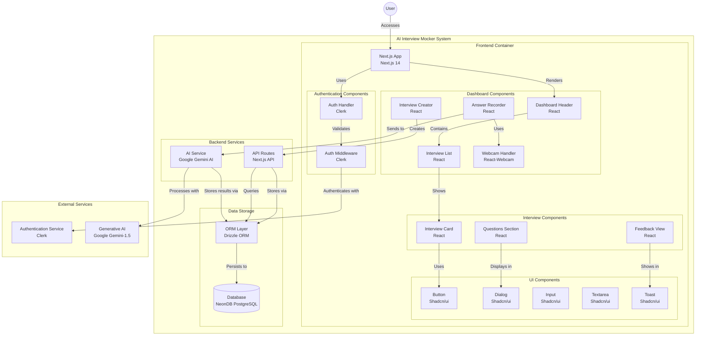
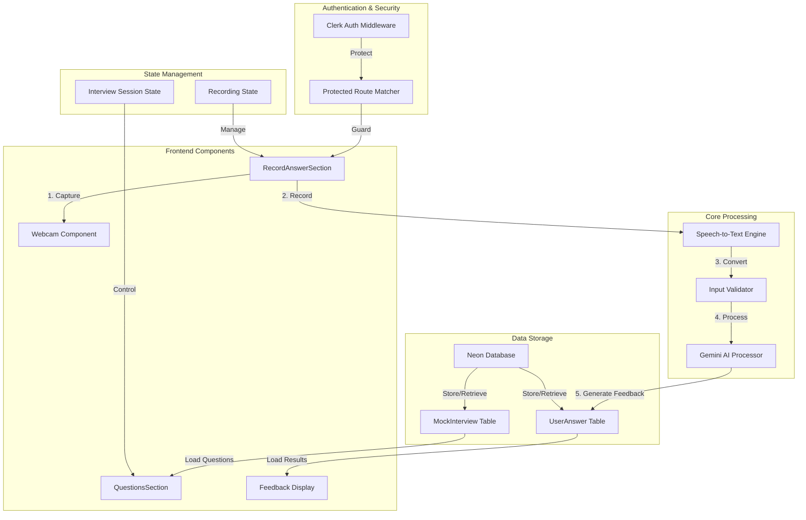

# AI Interview Mocker


## Introduction

AI Interview Mocker is a web-based application designed to help users practice for job interviews by providing AI-generated interview questions and feedback. The application leverages cutting-edge AI technologies to simulate real interview scenarios, helping users to prepare effectively and boost their confidence.

## Features

- **AI-Generated Questions:** Get a variety of interview questions generated by AI.
- **Real-time Feedback:** Receive instant feedback on your answers to improve your performance.
- **Customizable Settings:** Tailor the interview experience to match your specific needs.
- **User-Friendly Interface:** Enjoy a clean and intuitive user interface for a seamless experience.

## Technologies Used

A full-stack AI-powered mock interview app built with Next.js, Tailwind CSS, Drizzle ORM, and PostgreSQL. It uses Gemini AI to simulate real-world interview scenarios, providing instant feedback and personalized insights. Integrated with Clerk for user authentication, offering a seamless and interactive preparation experience for job seekers.

## Flowchart 


## How interview data flows from RecordAnswerSection through the feedback generation process to final storage


## Project Structure

```plaintext
AI-Interview-Mocker/
├── .gitignore
├── README.md
├── app/
├── components.json
├── components/
├── drizzle.config.js
├── hooks/
├── jsconfig.json
├── lib/
├── middleware.ts
├── next.config.mjs
├── package-lock.json
├── package.json
├── postcss.config.mjs
├── public/
├── tailwind.config.mjs
└── utils/
```

## Getting Started

### Prerequisites

- Node.js and npm installed on your machine.

### Installation

1. Clone the repository:

   ```bash
   git clone https://github.com/Munirab01/AI-Interview-Mocker.git
   cd AI-Interview-Mocker
   ```

2. Install dependencies:

   ```bash
   npm install
   ```

### Running the Application

To start the development server, run:

```bash
npm run dev
```

Open [http://localhost:3000](http://localhost:3000) in your browser to see the application.

## Contributing

We welcome contributions from the community! Please follow these steps:

1. Fork the repository.
2. Create a new branch for your feature or bugfix.
3. Commit your changes and push to your fork.
4. Create a pull request with a detailed description of your changes.

## License

This project is licensed under the MIT License. See the [LICENSE](LICENSE) file for details.

## Acknowledgements

- Thanks to all contributors and the open-source community for their support and contributions.

## Contact

For any inquiries or feedback, please contact [Munira Bhalam](mailto:bhalam.munira@gmail.com).
